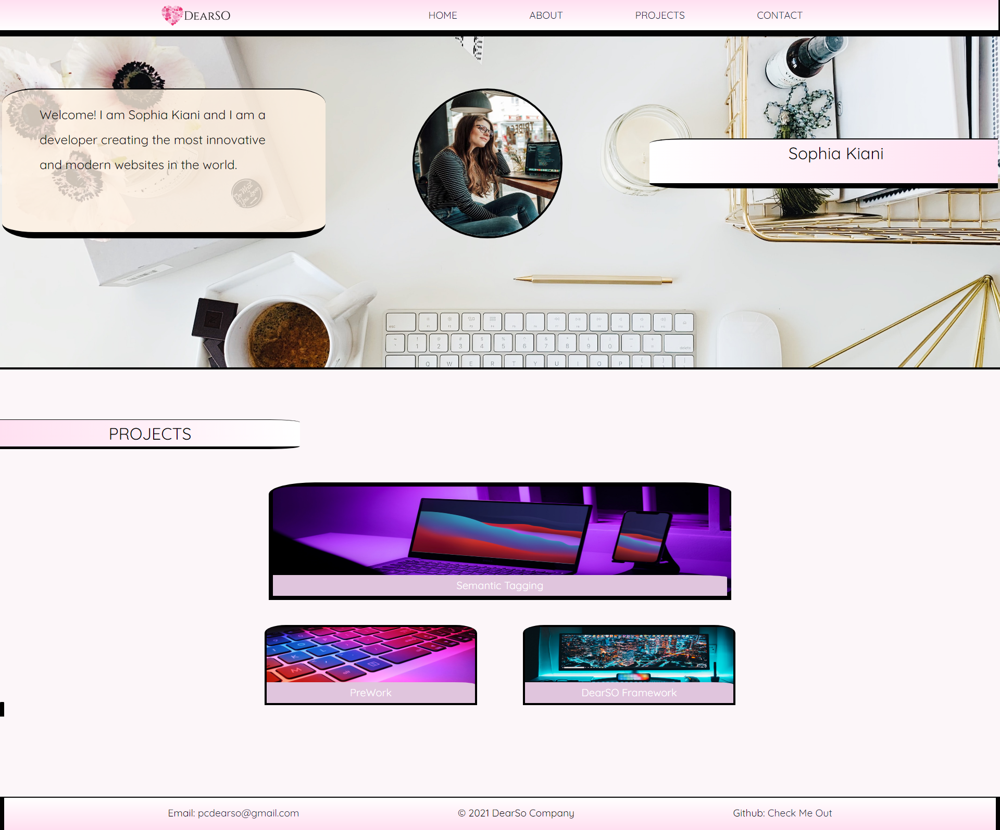

# Portfolio Profile

    
    

    
    

## Overview
    This file contains the basic html and css for the webpage of Sophia Kiani's Portfolio, 
    include DearSO logo, naviagtion bar, hero, pictures, and project section with links. 

## Table of Contents
- [Overview](#overview)
- [Authors](#authors)
- [Preview](#preview)
- [Features](#features)
- [Demo](#linktodeployedpage)
- [Preview](#preview)
- [Repo](#linktodeployedrepo)
- [Contribution](#contribution)
- [License](#license)

## Authors
- Author: Sophia
- [Sophia](https://github.com/soph-k)
- Version 1.1

## Features
- HTML
- CSS

## Link to Deployed Page
[Demo Live](https://soph-k.github.io/sophia_kiani_portfolio_profile/)

## Preview

    
## Link to Deployed Repo
[Repo](https://github.com/soph-k/sophia_kiani_portfolio_profile/)

## Contribution
Contributions are accepted. Feel free to fork without permission.

## License
This project is under the MIT license.

### Questions
For questions about this project, please review my GitHub repo at [soph-k](https://github.com/soph-k) or contact me on Github.
 

### Bugs
There are currently no known bugs within this file.
